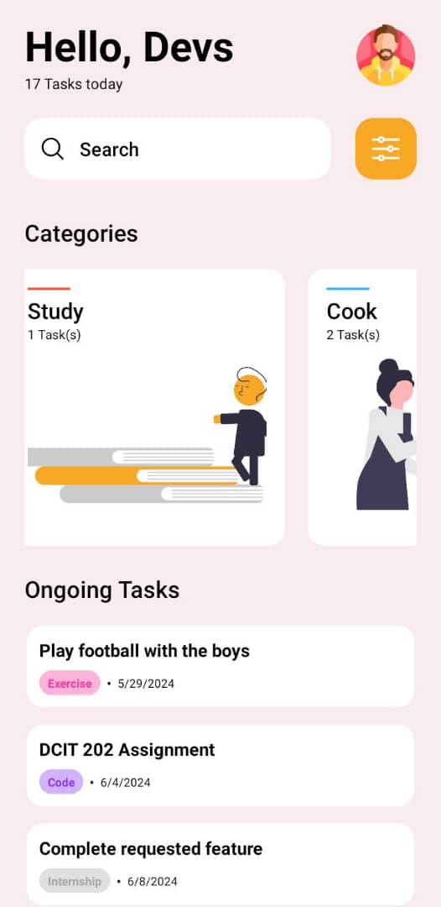
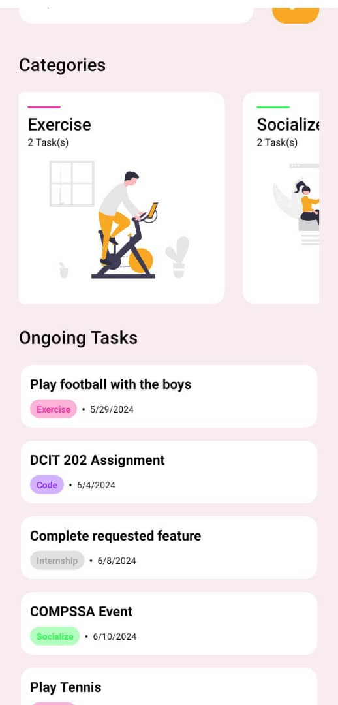
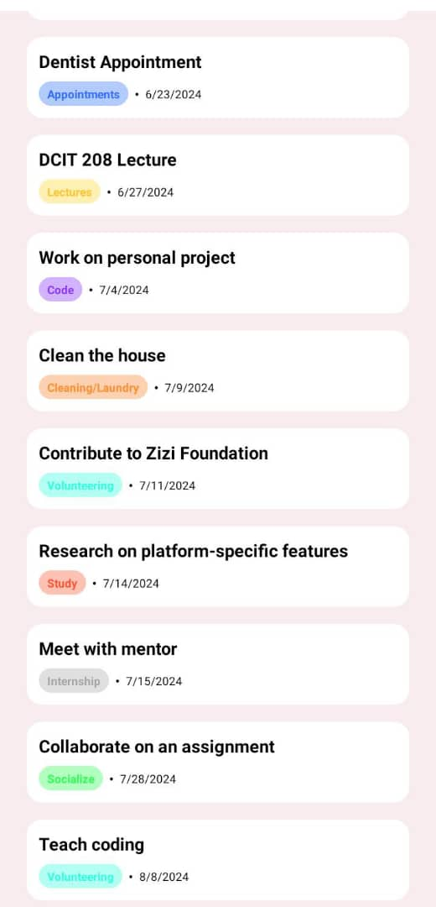

# DCIT 202 Assignment 3
## Kwabena Owusu-Darko (11170189)

This assigment involved converting a figma design into a functioning Expo application.

We discovered the implementations of Flat lists, Text Inputs and Scroll Views, while implementing custom react native components composed of a myriad of view and text components.

Here are a few screenshots of the application:

